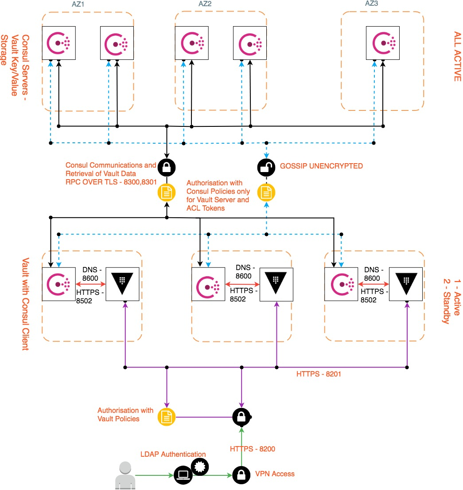

# Building a Vault Infrastructure
[Vault](https://www.hashicorp.com/products/vault/) is a secure, reliable store for password, encryption keys, SSL Certificates.
[Terraform](https://www.hashicorp.com/products/terraform/) is used to provision a Vault infrastructure with [Consul](https://www.hashicorp.com/products/consul/) backend for high availability (HA) on Blue/Green setup. [Terragrunt](https://github.com/gruntwork-io/terragrunt) is used as a wrapper over terraform code to put dependencies between folders and execute all folders.

## Vault Infrastructure Layout
The code for Vault Infrastructure is divided into three functions:
1. Basic AWS Infrastructure.
2. Consul Backend.
3. Vault Cluster.

## How is it structured
* Code is separated into folders based on its function and requirement:
* Each folder contains remotestate.tf, terraform.tfvars, output.tf and variables.tf by Default
    * *remotestate.tf* - Terraform remote state definition.
    * *terraform.tfvars* - Terragrunt Dependency definitions.
    * *variables.tf* - Terraform variables.
    * *output.tf* - Terraform output definitions.
* Apart of the above, folders will sub-folders and tf files which contains terraform resource or module definitions and files for the Infrastructure
* On the Base folder, *common.tfvars* and *terraform.tfvars* contain values to all variables and terraform.tfvars containing the Terragrunt definition.

Terragrunt dependencies are created in the order defined above.

## How to Run this code

> Note: Prepare the files *common.tfvars* and *terraform.tfvars*

### Initial One Time Setup
Since we are using External CA for the certificates used for Vault and Consul, these needs to be done in stages. These needs to be done only for the first time. Post that we can use `plan-all` or `apply-all` for planning and creating the setup

1. Go to *basic_infra* folder and run `terragrunt plan` to plan the infrastructure and `terragrunt apply` to apply the infrastructure.
2. Then go to consul and execute `terragrunt  plan/apply --target` on all the key and csr modules.
3. Then go to vault and execute `terragrunt  plan/apply --target` on all the key and csr modules.
4. Get the CSRs from the output variables of the respective folders and get it signed by the CA.
5. Copy the signed certificates to *certs* folder of Vault and Consul.

Post the above, run `terragrunt plan-all or apply-all` from the root folder to create rest of the Infrastructure.

### Toggling Blue/Green
This example assumes that we do have a Blue setup running and we wanted to setup and switch to Green:

1. Make necessary changes to policies, user data scripts, vault or consul config changes as required in Green folder.
2. First create the Green servers, by running `terragrunt plan-all/apply-all -var is_blue_mode_active="yes" -var is_green_mode_active="yes" -var keep_dns_deployment_mode="blue"`
3. Post the verification of Green Setup, to Switch over, run
`terragrunt plan-all/apply-all -var is_blue_mode_active="no" -var is_green_mode_active="yes" -var keep_dns_deployment_mode="green"`

## Overview of Setup done by Terraform
Because of the Terragrunt dependency definition, we create the necessary AWS infrastructure like VPC, Gateways, etc and then build Consul Servers with Initial Setup and then move on to create Vault Clusters.

### Basic Infrastructure (base_infra)
This section of Terraform Code creates 3 basic requirements needed for the Base Infrastructure to support Vault and Consul Nodes:

* [AWS Basic Infrastructure](#AWSBasicInfrastructure)
* [KMS Key](#KMSKeyCreation) for Encrypting Vault Management Tokens and ACL Tokens generated during Consul Initial setup
* Configure alerts when Backup of Consul Failed

#### AWS Basic Infrastructure
* A VPC with dhcp options.
* One Public Subnet and 2 Private Subnets named consul and vault.
* One Internet Gateway for the project/region and NAT Gateways for each Availability Zone (based on `what_services_i_need` variable).
* One Generic Security Group to attach to Consul and Vault Nodes , with outbound to Amazon IPs of the region on 443.
* SSH Key Pair creation and uploading to AWS (based on `what_services_i_need` variable).
* VPC Peer to Monitoring (Prometheus) (based on `what_connections_i_need` variable).
* VPC Peer to VPN VPC (based on `what_connections_i_need` variable).
* Adds the necessary rules for inbound/outbound of Monitoring and VPN access (based on `subnet_names_on_route_to_peer` variable).
* Adds the Inbound SSH access to the Generic Security Group. (if `what_services_i_need` variable contains ssh).
* Attaches the VPC to existing Private Route53 Zone (based on `associate_private_zones` variable).

##### Amazon Machine Image (AMI)
A custom encrypted AMI which has all the necessary installations like Consul, Vault, etc and necessary firewall rules is available from [dwp/packer-infrastructure] (https://github.com/dwp/packer-infrastructure)

##### AWS KMS Key Creation
* Creates a KMS Key for Encrypting Vault Management Tokens and ACL Tokens created by Consul during initial setup.

## consul
This section of Terraform code creates all the necessary Consul Configuration, using a combination of Terraform and EC2 User data scripts, the setup done includes, creating certificates, configuring Consul Server configuration , do LVM operations, create and apply Consul ACL policies, Create ACL tokens, backup and restore from backup (if required). It also sets the Mutual TLS between Consul Server and Consul Client.

For Consul backup notification a Slack Hook and Lambda are used to pick up and notify on any problems with Consul Backup.

## vault
This section of Terraform code creates all the necessary Vault Configuration, using a combination of Terraform and EC2 User data scripts, the setup done includes, creating certificates, configuring Vault Server configuration, do LVM operations, apply Standard Vault ACL policies, Configure LDAP Groups and map LDAP groups with policies, rotate Unseal Keys and destroy root token.

## Setup Diagram
The terraform sets up the infrastructure described in this diagram:

# Future Plans
Planning to convert this into a Terraform child module which does all of these things with only variable changes.

# Maintainer
Burbank Team

# Author
Arun Jayanth

[Contribution guidelines for this project](./CONTRIBUTING.md)
